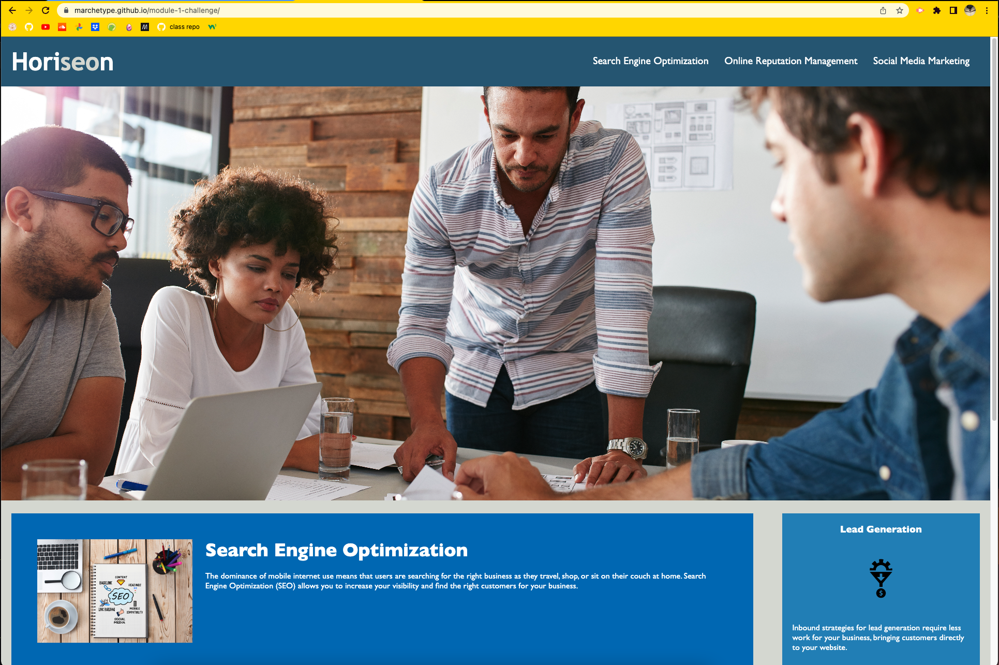

## README

# module-1-challenge

## Goals

### Refactoring code to be more accessible
 - The purpose of this project was to improve upon a website's accessibility by including the use of semantic HTML and alt attributes.
 - Semantic HTML helps to structure a website because it gives definition to the content within a specific section of a website. If all containers are labeled with the syntax:

        
 

    then it becomes far more difficult to navigate throughout the source code and find specific elements within the file.
 - Alt attributes are used to provide descriptions of any logos, icons, or images that are linked to a page. If someone accesses the webpage and the images do not load, then the description acts as a placeholder for the files.

### Refactoring code to be more efficient
 - A few portions of the source code were able to be improved upon in regards to the general structure. For example, many class selectors were able to be combined together through the use of commas:

- #### Ex.
    Instead of doing:

        .benefit-lead {
            margin-bottom: 32px;
            color: #ffffff;
        }

        .benefit-brand {
            margin-bottom: 32px;
            color: #ffffff;
        }

        .benefit-cost {
            margin-bottom: 32px;
            color: #ffffff;
        }

    This styling can be applied to all three at once:

        .benefit-lead, 
        .benefit-brand,
        .benefit-cost {
            margin-bottom: 32px;
            color: #ffffff;
        }

    I found that, after I consolidated these selectors, it was far easier to navigate the CSS file since the amount of code lines to look over had dropped significantly.
 - A few of my CSS classes had to be edited due to the change of element names within the HTML file. Since the 

        
 

    elements were renamed, it was as simple as correlating the correct semantic element into the CSS classes that were affected by the changes.

## Challenges and Application

 - The biggest challenge I faced while refactoring the code for the website was deciding which semantic elements were appropriate for each portion of content. For the most part, I believe that I succeeded, but I still am not 100% certain regarding the proper use for each semantic element.
 - Overall, I feel as though I am quite comfortable with the material presented in this challenge. Although it can be overwhelming at points to sift through lines and lines of code, I make sure to remind myself to take a short break and come back to the problem at hand. Typically I am able to pick up on whatever the error is soon after this and I resume my progress.

## Webpage Deployment

 - The link to the deployed GitHub Pages website is [here](https://marchetype.github.io/module-1-challenge/).
 - Screenshot of deployed site:
  

